# Vehicle Detection HOG + SVM :car: :taxi: :police_car:

This repository contains the implementation and a short overview of my Bachelor Thesis, 'Vehicle Detection Using Front Camera Image Classification'. The original thesis paper is written in Serbian, so this readme file will provide a recap of important points from the thesis. \
**NOTE**: sorry for the bad code... I recommend you take a look at `feature_extraction.py` and `sliding_window.py` scripts, since they are in a somewhat good shape.

## Table of Content
* [Pipeline](#Pipeline)
* [HOG features](#HOG-features) 
* [SVM classifiers](#SVM-classifiers)
* [Sliding window](#Sliding-window)
* [Results](#Results)

## Pipeline

The pipeline is given by the following flowchart:

    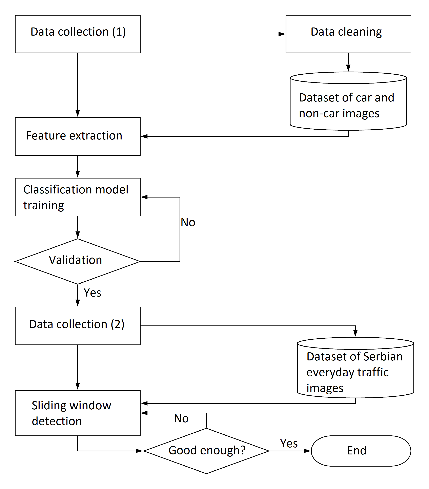

 The main idea of the first data collection process was to gather enough labeled data for classifier training, meaning that we looked for a lot of labeled images of cars, as well as non-car items (parts of the road, road signs, pedestrians, ...). Following datasets were used:
* Car class: https://arxiv.org/abs/1506.08959
* Non-car class: https://btsd.ethz.ch/shareddata/

On the other hand, the second data collection process had the goal of gathering realistic and applicable training data, so we decided to go on a little data-hunt :camera:, driving around Serbia and collecting images from everyday traffic. 

## HOG features

Histograms of Oriented Gradients are a well-established method for extracting features from images. A high-level overview is given by the flowchart below. 

    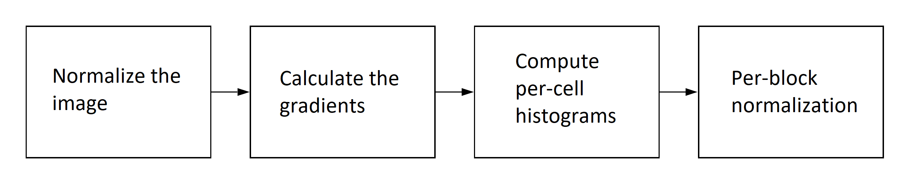

For additional information on HOG features please refer to these resources:
* https://gurus.pyimagesearch.com/lesson-sample-histogram-of-oriented-gradients-and-car-logo-recognition/
* https://www.analyticsvidhya.com/blog/2019/09/feature-engineering-images-introduction-hog-feature-descriptor/
* https://www.learnopencv.com/histogram-of-oriented-gradients/

Here are some examples of images of cars and their corresponding HOG feature visualizations:

HOG - cell size 10x10            |  Original image | HOG - cell size 15x15
:-------------------------:|:-------------------------:|:-------------------------:
 | 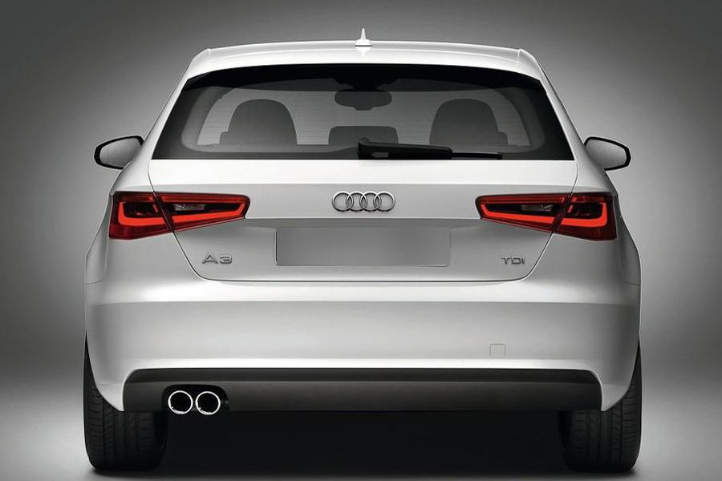 | 
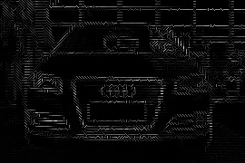 | 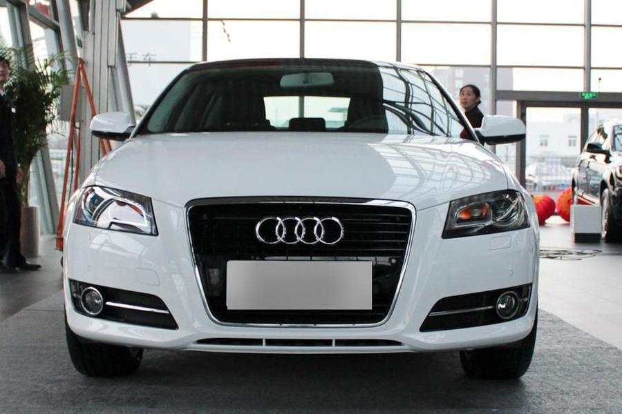 | 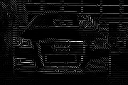
 | 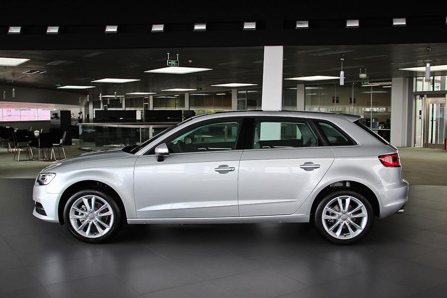 | 

As one could notice from the images above, the smaller the size of a HOG cell, the more information the features can 'carry'. Of course, the con of smaller cells is a longer computation time, but my emphasis was on getting a good enough precision, while the computation time got a bit neglected. \
The visualization of HOG features was implemented so that each gradient orientation is being mapped to a certain character in the image (/, -, \\, |) and, depending on the gradient magnitude, we scale the corresponding character somewhere in the range from 0 to 255. Here is a little plot representing the orientation -> character mapping (1 : '-', 2 : '/'. 3 : '|', 4 : '\\'):

    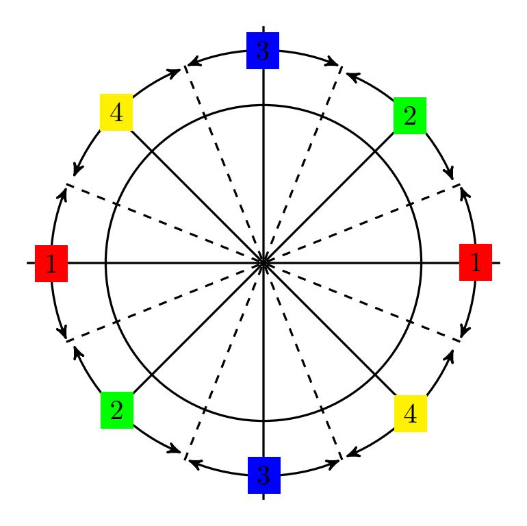

## SVM classifiers

Support Vector Machines classifiers are supervised machine learning models that, simply put, try to maximize the space between samples of different classes. For example, in the images below, on the left one could se a very simple classification problem with a few different linear classification lines that would solve this problem correctly. On the other hand, the image on the right demonstrates how an SVM classifier would maximize the space between the given samples of two classes (circles and squares). The dashed line represents the final classification line of the SVM.  

 Arbitrary (correct) classification lines  | Support Vector Machine
:-------------------------:|:-------------------------:
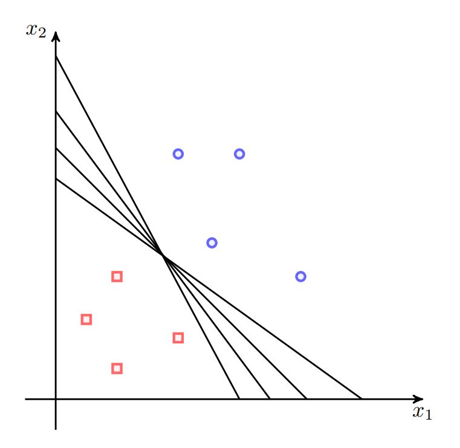 | 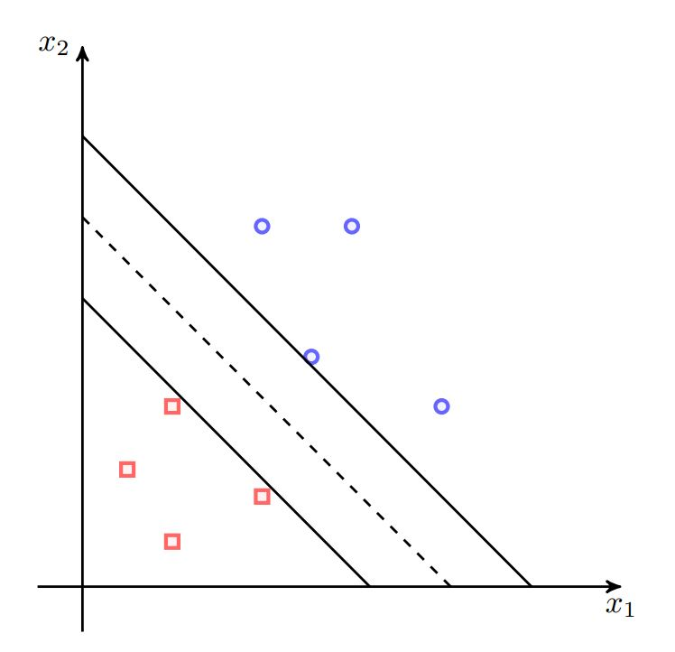

For additional information on HOG features please refer to these resources:
* https://see.stanford.edu/materials/aimlcs229/cs229-notes3.pdf
* https://ocw.mit.edu/courses/electrical-engineering-and-computer-science/6-034-artificial-intelligence-fall-2010/lecture-videos/lecture-16-learning-support-vector-machines/

## Sliding window

The sliding window method is a very simple method for iterating through an image, given iteration steps (per each axis) and window dimensions. At each iteration, this method takes a 'window', i.e. a crop of the image, extracts its features and determines the class for that single crop. As mentioned before, features are here represented as HOGs, and the classification models are SVMs.  

 

## Results

Here are some final results of my project! Of course, the model failed miserably in certain occasions, but really performed nicely of the time (again, I'm just going to skip the 'computation time' part of the story since it's a sad one :smile: ). 

### Fails

<table> 
    <tr>
        <td> 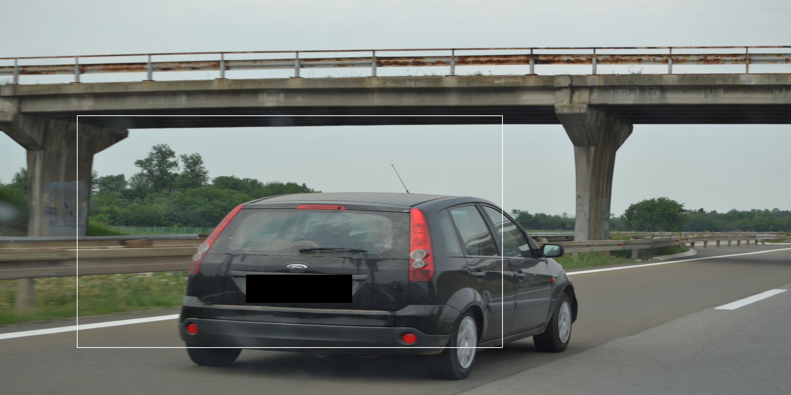 </td>
        <td>  </td>
    </tr> 
    <tr>
        <td> 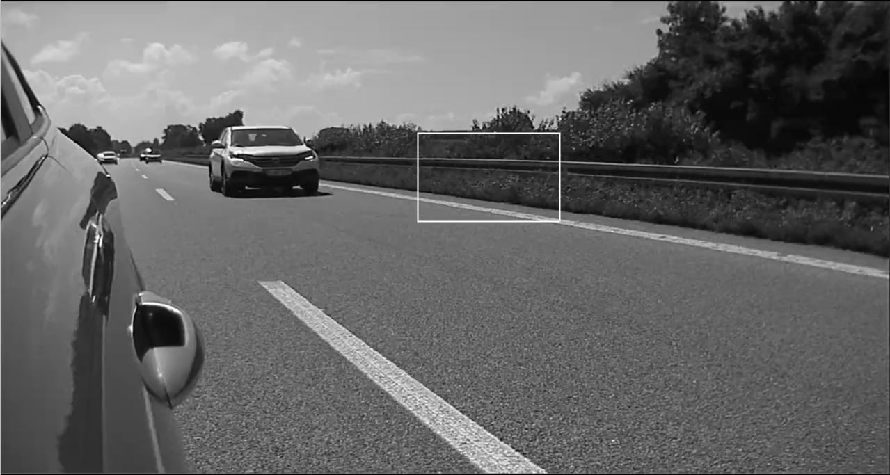 </td>
        <td> 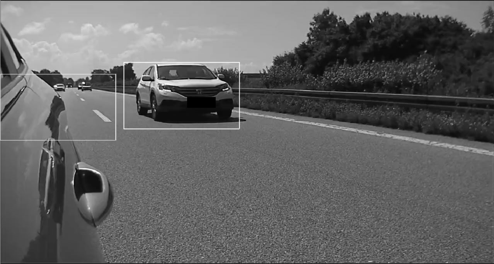 </td>
    </tr> 
</table>

### Successes

Now let's cheer up a bit with some positive outcomes!

<table> 
    <tr>
        <td> 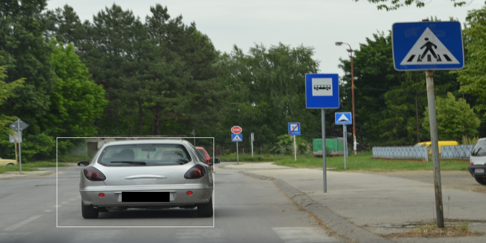 </td>
        <td> 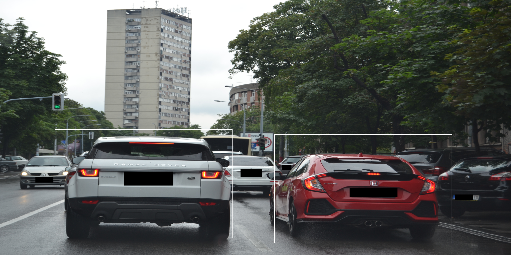 </td>
    </tr> 
    <tr>
        <td> 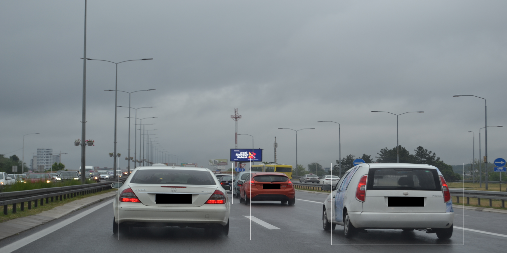 </td>
        <td> 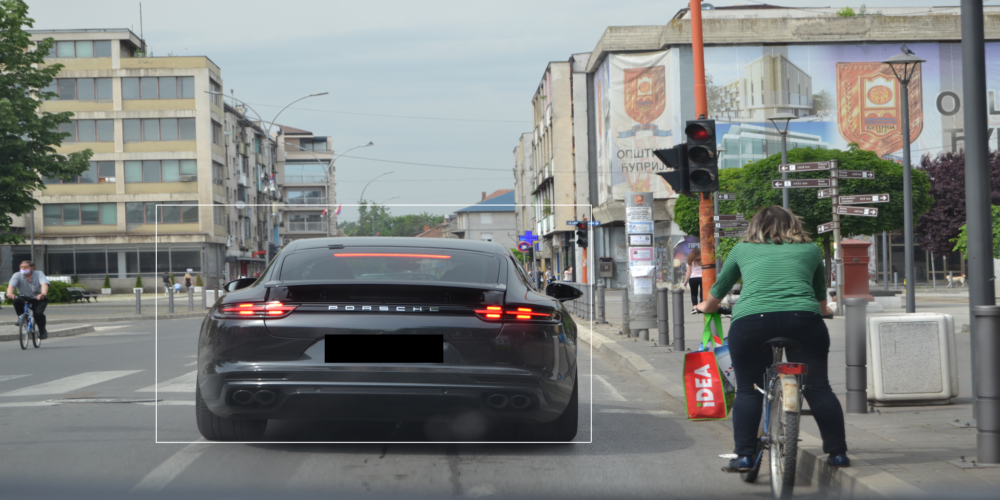 </td>
    </tr> 
</table>

In the end, here's a 'wide Putin' version of myself:

    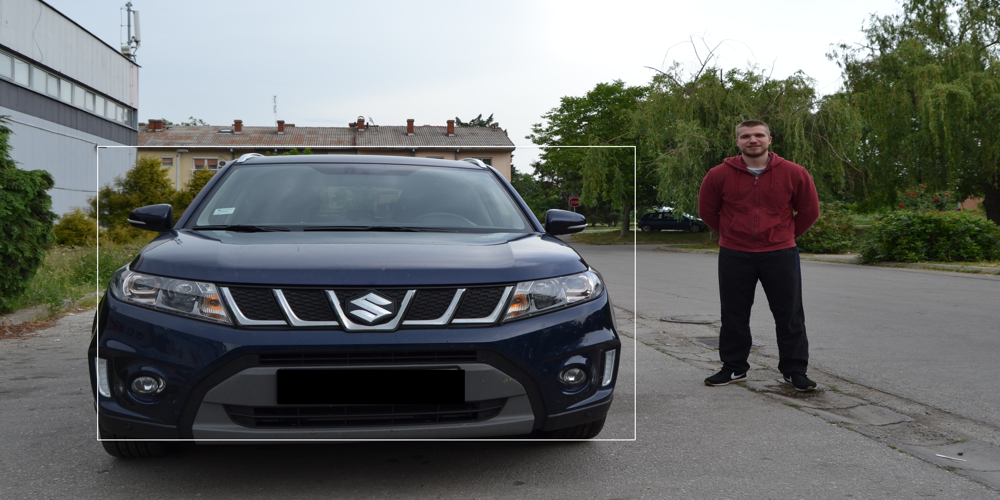

Thank you for your time, I hope you found it interesting and maybe even learned something new! :smile: :wave: