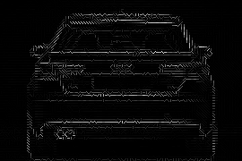
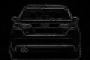
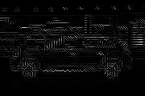

# Vehicle Detection HOG + SVM :car: :taxi: :police_car:

This repository contains the implementation and a short overview of my Bachelor Thesis, 'Vehicle Detection Using Front Camera Image Classification'. The original thesis paper is written in Serbian, so this readme file will provide a recap of important points from the thesis. 

## Table of Content
* [Pipeline](#pipeline)
* [HOG features](#HOG-features) 
* [SVM classifiers](#svm)
* [Sliding window](#sliding_window)
* [Results](#results)

## Pipeline

The pipeline is given in the following flowchart:

 The main idea of the first data collection process was to gather enough labeled data for classifier training, meaning that we looked for a lot of labeled images of cars, as well as non-car items (parts of the road, road signs, pedestrians, ...). Following datasets were used:
* Car class: https://arxiv.org/abs/1506.08959
* Non-car class: https://btsd.ethz.ch/shareddata/

On the other hand, the second data collection process had the goal of gathering realistic and applicable training data, so we decided to go on a little data-hunt :camera:, driving around Serbia and collecting images from everyday traffic. 

## HOG features

Histograms of Oriented Gradients are a well-established method for extracting features from images. A high-level overview is given by the flowchart below. 

For additional information on HOG features please refer to these resources:
* https://gurus.pyimagesearch.com/lesson-sample-histogram-of-oriented-gradients-and-car-logo-recognition/
* https://www.analyticsvidhya.com/blog/2019/09/feature-engineering-images-introduction-hog-feature-descriptor/
* https://www.learnopencv.com/histogram-of-oriented-gradients/

Here are some examples of images of cars and their corresponding HOG feature visualizations:

HOG - cell size 10x10            |  Original image | HOG - cell size 15x15
:-------------------------:|:-------------------------:|:-------------------------:
 |  | 
 |  | 
 |  | 

As one could notice from the images above, the smaller the size of a HOG cell, the more information the features can 'carry'. Of course, the con of smaller cells is a longer computation time, but my emphasis was on getting a good enough precision, while the computation time got a bit neglected. \
The visualization of HOG features was implemented so that each gradient orientation is being mapped to a certain character in the image (/, -, \, |) and, depending on the gradient magnitute, we scale the corresponding character somewhere in the range from 0 to 255. 